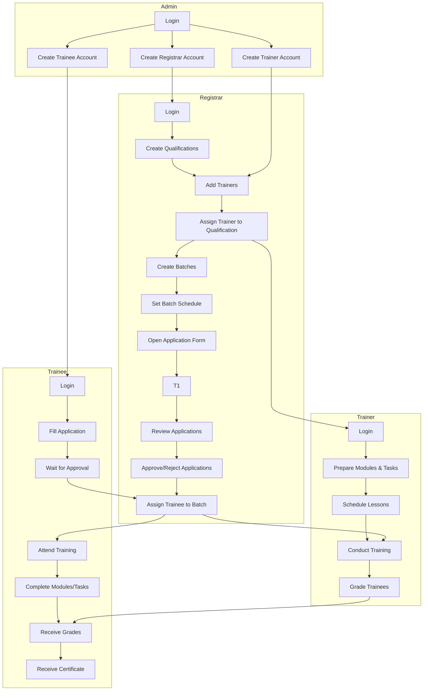

# Hohoo-ville System Flow (Role-Based)

## 1. Admin
* Logs in
* Creates registrar, trainer, and trainee accounts
* Oversees user management and system setup

## 2. Registrar
* Logs in
* Creates qualifications/courses
* Adds trainers and assigns them to qualifications
* Creates batches and sets schedules
* Opens application form for trainees
* Reviews and approves/rejects trainee applications
* Assigns approved trainees to batches

## 3. Trainer
* Logs in
* Prepares modules, tasks, and lessons for assigned batches
* Schedules lessons and posts materials/quizzes
* Grades trainees

## 4. Trainee
* Logs in
* Fills out application form
* Waits for approval and batch assignment
* Attends training, completes modules/tasks
* Receives grades and notifications
* Receives certificate upon completion

---

---

**Description:**
- This diagram shows the workflow by role: admin, registrar, trainer, and trainee.
- Each subgraph groups actions by role, with arrows showing the process and cross-role dependencies.
- Visualize this using Mermaid.js or compatible VS Code plugins.
